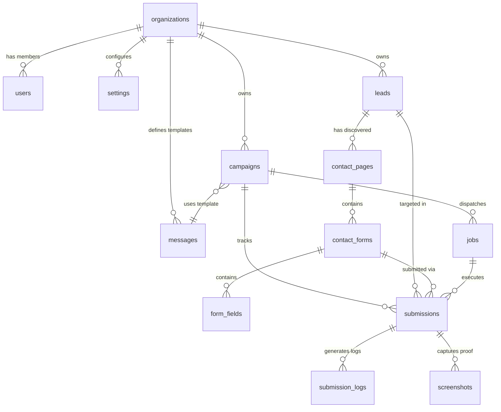

# Bulk Contact Form Outreach System — Database Schema Specification

---

## 1. Schema Overview & Entity-Relationship Model

The database is built on **PostgreSQL (Supabase)**, utilizing **Row-Level Security (RLS)** for multi-tenant isolation, optimized B-Tree and GIN indexes for high query performance, and strict foreign key relationships with cascading policies.

### 1.1 Complete Entity-Relationship Diagram



---

## 2. Enumerated Types (Enums) & State Machines

```sql
-- User Roles
CREATE TYPE user_role AS ENUM ('owner', 'admin', 'operator', 'viewer');

-- Campaign Status Lifecycle
CREATE TYPE campaign_status AS ENUM (
    'draft',
    'scheduled',
    'running',
    'paused',
    'completed',
    'archived'
);

-- Lead Status State Machine
CREATE TYPE lead_status AS ENUM (
    'PENDING',
    'QUEUED',
    'PROCESSING',
    'CONTACT_PAGE_FOUND',
    'FORM_DETECTED',
    'DRY_RUN_COMPLETED',
    'SUBMITTED',
    'REVIEW_REQUIRED',
    'BLOCKED',
    'FAILED',
    'SKIPPED'
);

-- Job Status Lifecycle
CREATE TYPE job_status AS ENUM (
    'waiting',
    'active',
    'completed',
    'failed',
    'delayed',
    'paused'
);

-- Form Field Semantic Classification
CREATE TYPE form_field_type AS ENUM (
    'first_name',
    'last_name',
    'full_name',
    'email',
    'phone',
    'company',
    'website',
    'subject',
    'message',
    'consent_checkbox',
    'custom',
    'honeypot',
    'unknown'
);

-- Submission Outcome Status
CREATE TYPE submission_status AS ENUM (
    'SUCCESS',
    'DRY_RUN_SUCCESS',
    'CAPTCHA_TRIGGERED',
    'VALIDATION_ERROR',
    'BLOCKED_403_429',
    'TIMEOUT',
    'SERVER_ERROR',
    'AMBIGUOUS_OUTCOME'
);

-- Screenshot Proof Category
CREATE TYPE screenshot_type AS ENUM (
    'pre_submit',
    'post_submit',
    'error_state',
    'captcha_state',
    'manual_review'
);
```

---

## 3. Comprehensive Table Definitions

### 3.1 `organizations`
Multi-tenant organizational container.
```sql
CREATE TABLE organizations (
    id UUID PRIMARY KEY DEFAULT gen_random_uuid(),
    name VARCHAR(255) NOT NULL,
    slug VARCHAR(255) UNIQUE NOT NULL,
    created_at TIMESTAMPTZ NOT NULL DEFAULT NOW(),
    updated_at TIMESTAMPTZ NOT NULL DEFAULT NOW()
);
```

### 3.2 `users`
Authenticated users linked to Supabase Auth.
```sql
CREATE TABLE users (
    id UUID PRIMARY KEY REFERENCES auth.users(id) ON DELETE CASCADE,
    organization_id UUID NOT NULL REFERENCES organizations(id) ON DELETE CASCADE,
    email VARCHAR(255) UNIQUE NOT NULL,
    first_name VARCHAR(100),
    last_name VARCHAR(100),
    role user_role NOT NULL DEFAULT 'operator',
    avatar_url TEXT,
    created_at TIMESTAMPTZ NOT NULL DEFAULT NOW(),
    updated_at TIMESTAMPTZ NOT NULL DEFAULT NOW()
);

CREATE INDEX idx_users_org ON users(organization_id);
```

### 3.3 `settings`
Organization-wide defaults, rate limits, and safety policies.
```sql
CREATE TABLE settings (
    id UUID PRIMARY KEY DEFAULT gen_random_uuid(),
    organization_id UUID UNIQUE NOT NULL REFERENCES organizations(id) ON DELETE CASCADE,
    default_is_dry_run BOOLEAN NOT NULL DEFAULT TRUE,
    max_concurrent_workers INT NOT NULL DEFAULT 5 CHECK (max_concurrent_workers BETWEEN 1 AND 50),
    rate_limit_per_minute INT NOT NULL DEFAULT 10 CHECK (rate_limit_per_minute BETWEEN 1 AND 120),
    inter_page_delay_ms INT NOT NULL DEFAULT 3000 CHECK (inter_page_delay_ms >= 1000),
    page_navigation_timeout_ms INT NOT NULL DEFAULT 30000,
    form_detection_timeout_ms INT NOT NULL DEFAULT 10000,
    global_suppression_domains TEXT[] DEFAULT '{}',
    global_suppression_emails TEXT[] DEFAULT '{}',
    webhook_url TEXT,
    webhook_secret TEXT,
    created_at TIMESTAMPTZ NOT NULL DEFAULT NOW(),
    updated_at TIMESTAMPTZ NOT NULL DEFAULT NOW()
);
```

### 3.4 `messages`
Reusable message templates with dynamic variable interpolation and Spintax.
```sql
CREATE TABLE messages (
    id UUID PRIMARY KEY DEFAULT gen_random_uuid(),
    organization_id UUID NOT NULL REFERENCES organizations(id) ON DELETE CASCADE,
    name VARCHAR(255) NOT NULL,
    subject_template TEXT,
    body_template TEXT NOT NULL,
    compliance_footer TEXT NOT NULL,
    is_spintax_enabled BOOLEAN NOT NULL DEFAULT TRUE,
    created_at TIMESTAMPTZ NOT NULL DEFAULT NOW(),
    updated_at TIMESTAMPTZ NOT NULL DEFAULT NOW()
);

CREATE INDEX idx_messages_org ON messages(organization_id);
```

### 3.5 `campaigns`
Campaign orchestration configurations.
```sql
CREATE TABLE campaigns (
    id UUID PRIMARY KEY DEFAULT gen_random_uuid(),
    organization_id UUID NOT NULL REFERENCES organizations(id) ON DELETE CASCADE,
    message_id UUID REFERENCES messages(id) ON DELETE SET NULL,
    name VARCHAR(255) NOT NULL,
    status campaign_status NOT NULL DEFAULT 'draft',
    is_dry_run BOOLEAN NOT NULL DEFAULT TRUE,
    total_leads INT NOT NULL DEFAULT 0,
    processed_leads INT NOT NULL DEFAULT 0,
    successful_submissions INT NOT NULL DEFAULT 0,
    review_required_leads INT NOT NULL DEFAULT 0,
    failed_leads INT NOT NULL DEFAULT 0,
    rate_limit_per_minute INT NOT NULL DEFAULT 10,
    max_concurrency INT NOT NULL DEFAULT 5,
    scheduled_at TIMESTAMPTZ,
    started_at TIMESTAMPTZ,
    completed_at TIMESTAMPTZ,
    created_at TIMESTAMPTZ NOT NULL DEFAULT NOW(),
    updated_at TIMESTAMPTZ NOT NULL DEFAULT NOW()
);

CREATE INDEX idx_campaigns_org_status ON campaigns(organization_id, status);
```

### 3.6 `leads`
Target lead records imported from CSV, Excel, or Google Sheets.
```sql
CREATE TABLE leads (
    id UUID PRIMARY KEY DEFAULT gen_random_uuid(),
    organization_id UUID NOT NULL REFERENCES organizations(id) ON DELETE CASCADE,
    domain VARCHAR(255) NOT NULL,
    website VARCHAR(1024) NOT NULL,
    company_name VARCHAR(255),
    first_name VARCHAR(100),
    last_name VARCHAR(100),
    email VARCHAR(255),
    phone VARCHAR(50),
    industry VARCHAR(100),
    city VARCHAR(100),
    country VARCHAR(100),
    custom_fields JSONB NOT NULL DEFAULT '{}',
    source_filename VARCHAR(255),
    created_at TIMESTAMPTZ NOT NULL DEFAULT NOW(),
    updated_at TIMESTAMPTZ NOT NULL DEFAULT NOW()
);

CREATE INDEX idx_leads_org_domain ON leads(organization_id, domain);
CREATE INDEX idx_leads_custom_fields ON leads USING GIN (custom_fields);
```

### 3.7 `contact_pages`
Discovered contact URLs for each target lead.
```sql
CREATE TABLE contact_pages (
    id UUID PRIMARY KEY DEFAULT gen_random_uuid(),
    lead_id UUID NOT NULL REFERENCES leads(id) ON DELETE CASCADE,
    url VARCHAR(1024) NOT NULL,
    discovery_method VARCHAR(50) NOT NULL, -- 'homepage_anchor', 'path_probe', 'homepage_embedded'
    http_status_code INT,
    page_title TEXT,
    has_contact_form BOOLEAN NOT NULL DEFAULT FALSE,
    discovered_at TIMESTAMPTZ NOT NULL DEFAULT NOW()
);

CREATE INDEX idx_contact_pages_lead ON contact_pages(lead_id);
```

### 3.8 `contact_forms`
Detected HTML forms and iframe containers on contact pages.
```sql
CREATE TABLE contact_forms (
    id UUID PRIMARY KEY DEFAULT gen_random_uuid(),
    contact_page_id UUID NOT NULL REFERENCES contact_pages(id) ON DELETE CASCADE,
    form_selector VARCHAR(255) NOT NULL,
    is_in_iframe BOOLEAN NOT NULL DEFAULT FALSE,
    iframe_src VARCHAR(1024),
    form_action VARCHAR(1024),
    form_method VARCHAR(10) DEFAULT 'POST',
    confidence_score NUMERIC(5,2) NOT NULL DEFAULT 0.00,
    has_honeypot BOOLEAN NOT NULL DEFAULT FALSE,
    has_captcha_challenge BOOLEAN NOT NULL DEFAULT FALSE,
    captcha_type VARCHAR(50), -- 'recaptcha_v2', 'recaptcha_v3', 'hcaptcha', 'turnstile'
    created_at TIMESTAMPTZ NOT NULL DEFAULT NOW()
);

CREATE INDEX idx_contact_forms_page ON contact_forms(contact_page_id);
```

### 3.9 `form_fields`
Parsed input elements, textareas, selects, and checkboxes belonging to a contact form.
```sql
CREATE TABLE form_fields (
    id UUID PRIMARY KEY DEFAULT gen_random_uuid(),
    contact_form_id UUID NOT NULL REFERENCES contact_forms(id) ON DELETE CASCADE,
    element_tag VARCHAR(50) NOT NULL, -- 'input', 'textarea', 'select'
    input_type VARCHAR(50),           -- 'text', 'email', 'tel', 'checkbox', 'hidden'
    field_name VARCHAR(255),
    field_id VARCHAR(255),
    field_placeholder TEXT,
    field_label TEXT,
    css_selector VARCHAR(255) NOT NULL,
    is_required BOOLEAN NOT NULL DEFAULT FALSE,
    is_visible BOOLEAN NOT NULL DEFAULT TRUE,
    is_honeypot BOOLEAN NOT NULL DEFAULT FALSE,
    mapped_semantic_type form_field_type NOT NULL DEFAULT 'unknown',
    match_confidence NUMERIC(5,2) NOT NULL DEFAULT 0.00,
    created_at TIMESTAMPTZ NOT NULL DEFAULT NOW()
);

CREATE INDEX idx_form_fields_form ON form_fields(contact_form_id);
```

### 3.10 `jobs`
Execution tasks managed across BullMQ and Redis.
```sql
CREATE TABLE jobs (
    id UUID PRIMARY KEY DEFAULT gen_random_uuid(),
    campaign_id UUID NOT NULL REFERENCES campaigns(id) ON DELETE CASCADE,
    lead_id UUID NOT NULL REFERENCES leads(id) ON DELETE CASCADE,
    bullmq_job_id VARCHAR(255) UNIQUE,
    queue_name VARCHAR(100) NOT NULL DEFAULT 'outreach-execution',
    status job_status NOT NULL DEFAULT 'waiting',
    attempts INT NOT NULL DEFAULT 0,
    max_attempts INT NOT NULL DEFAULT 2,
    lock_expires_at TIMESTAMPTZ,
    worker_id VARCHAR(255),
    started_at TIMESTAMPTZ,
    finished_at TIMESTAMPTZ,
    created_at TIMESTAMPTZ NOT NULL DEFAULT NOW()
);

CREATE INDEX idx_jobs_campaign_status ON jobs(campaign_id, status);
CREATE INDEX idx_jobs_bullmq_id ON jobs(bullmq_job_id);
```

### 3.11 `submissions`
Result and outcome record for every outreach attempt.
```sql
CREATE TABLE submissions (
    id UUID PRIMARY KEY DEFAULT gen_random_uuid(),
    campaign_id UUID NOT NULL REFERENCES campaigns(id) ON DELETE CASCADE,
    lead_id UUID NOT NULL REFERENCES leads(id) ON DELETE CASCADE,
    job_id UUID REFERENCES jobs(id) ON DELETE SET NULL,
    contact_form_id UUID REFERENCES contact_forms(id) ON DELETE SET NULL,
    status submission_status NOT NULL,
    lead_status lead_status NOT NULL,
    is_dry_run BOOLEAN NOT NULL,
    submitted_payload JSONB NOT NULL DEFAULT '{}',
    http_response_status INT,
    error_code VARCHAR(100),
    error_message TEXT,
    manual_review_notes TEXT,
    resolved_by_user_id UUID REFERENCES users(id) ON DELETE SET NULL,
    resolved_at TIMESTAMPTZ,
    submitted_at TIMESTAMPTZ,
    created_at TIMESTAMPTZ NOT NULL DEFAULT NOW()
);

CREATE INDEX idx_submissions_campaign_status ON submissions(campaign_id, status);
CREATE INDEX idx_submissions_lead ON submissions(lead_id);
```

### 3.12 `submission_logs`
Chronological telemetry events and step audits for each submission execution.
```sql
CREATE TABLE submission_logs (
    id UUID PRIMARY KEY DEFAULT gen_random_uuid(),
    submission_id UUID NOT NULL REFERENCES submissions(id) ON DELETE CASCADE,
    step_name VARCHAR(100) NOT NULL,
    level VARCHAR(20) NOT NULL DEFAULT 'info' CHECK (level IN ('debug', 'info', 'warn', 'error')),
    message TEXT NOT NULL,
    duration_ms INT,
    context JSONB NOT NULL DEFAULT '{}',
    created_at TIMESTAMPTZ NOT NULL DEFAULT NOW()
);

CREATE INDEX idx_submission_logs_submission ON submission_logs(submission_id);
```

### 3.13 `screenshots`
Visual proof images archived for validation and review.
```sql
CREATE TABLE screenshots (
    id UUID PRIMARY KEY DEFAULT gen_random_uuid(),
    submission_id UUID NOT NULL REFERENCES submissions(id) ON DELETE CASCADE,
    type screenshot_type NOT NULL,
    storage_path TEXT NOT NULL,
    file_size_bytes INT,
    dimensions_width INT DEFAULT 1280,
    dimensions_height INT DEFAULT 800,
    created_at TIMESTAMPTZ NOT NULL DEFAULT NOW()
);

CREATE INDEX idx_screenshots_submission ON screenshots(submission_id);
```

---

## 4. Row-Level Security (RLS) Policies

All tables enforce tenant-level isolation using Supabase RLS:

```sql
-- Enable RLS on all operational tables
ALTER TABLE organizations ENABLE ROW LEVEL SECURITY;
ALTER TABLE users ENABLE ROW LEVEL SECURITY;
ALTER TABLE settings ENABLE ROW LEVEL SECURITY;
ALTER TABLE messages ENABLE ROW LEVEL SECURITY;
ALTER TABLE campaigns ENABLE ROW LEVEL SECURITY;
ALTER TABLE leads ENABLE ROW LEVEL SECURITY;
ALTER TABLE contact_pages ENABLE ROW LEVEL SECURITY;
ALTER TABLE contact_forms ENABLE ROW LEVEL SECURITY;
ALTER TABLE form_fields ENABLE ROW LEVEL SECURITY;
ALTER TABLE jobs ENABLE ROW LEVEL SECURITY;
ALTER TABLE submissions ENABLE ROW LEVEL SECURITY;
ALTER TABLE submission_logs ENABLE ROW LEVEL SECURITY;
ALTER TABLE screenshots ENABLE ROW LEVEL SECURITY;

-- Base Tenant Policy Macro: User can only access records in their organization
CREATE POLICY org_tenant_isolation_leads ON leads
    FOR ALL
    USING (organization_id = (SELECT organization_id FROM users WHERE id = auth.uid()));

CREATE POLICY org_tenant_isolation_campaigns ON campaigns
    FOR ALL
    USING (organization_id = (SELECT organization_id FROM users WHERE id = auth.uid()));

CREATE POLICY org_tenant_isolation_submissions ON submissions
    FOR ALL
    USING (campaign_id IN (SELECT id FROM campaigns WHERE organization_id = (SELECT organization_id FROM users WHERE id = auth.uid())));
```
